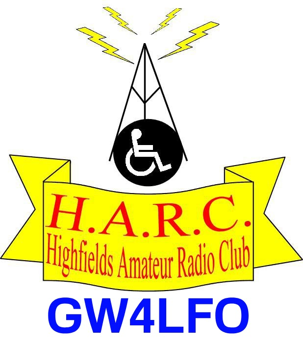

# Hi there, I'm dwincymraeg! 👋

  

## ✍️ About Me

  

I'm a young coder based in the beautiful valleys of **Abertridwr, South Wales, UK**. 🏴󠁧󠁢󠁷󠁬󠁳󠁿

When I'm not writing code or debugging, you'll usually find me tuned into a radio frequency, hitting the trails on my bike, or tearing up some terrain on my quad bike. I'm passionate about blending the digital world with the physical world—whether that's through software development or radio waves.

---

## 📊 My GitHub Stats

  
  

---

## 🛠 About Me
* **Location:** Abertridwr, South Wales, UK 📍
* **Passions:**
    * **Coding:** Exploring new languages, building tools, and solving complex problems.
    * **Radio:** Soon to be licensed amateur radio operator and enthusiast. I love everything from building antennas to DXing.
    * **Outdoor Adventures:** You'll find me out biking or riding my quad bike whenever I get the chance.
* **Community:** Proud member of the **[Highfields Amateur Radio Club](https://sites.google.com/view/harccardiff)** (Check us out!).

---

## 📻 Radio Interests
Radio is a huge part of my life. It's not just about the gear; it's about connecting with people across the globe.
* **Ham Radio (Amateur Radio):** Building, experimenting, and communicating.
* **Community Radio:** Passionate about local broadcasting and the technical side of radio production.

---

## 🚴 Outside the Code
When the screen is off, I'm:
1.  **Biking:** Exploring the local Welsh hills and valleys.
2.  **Quad Biking:** Finding the muddiest path possible.

---

## 📬 Get In Touch
I’m always open to connecting with fellow coders, radio enthusiasts, or anyone interested in projects.

* **GitHub:** [dwincymraeg](https://github.com/dwincymraeg)
* **Email:** solomon@wilson.wales

---

## 📈 Activity & Trophies

  

  

  

---
*Last updated: June 2026*
